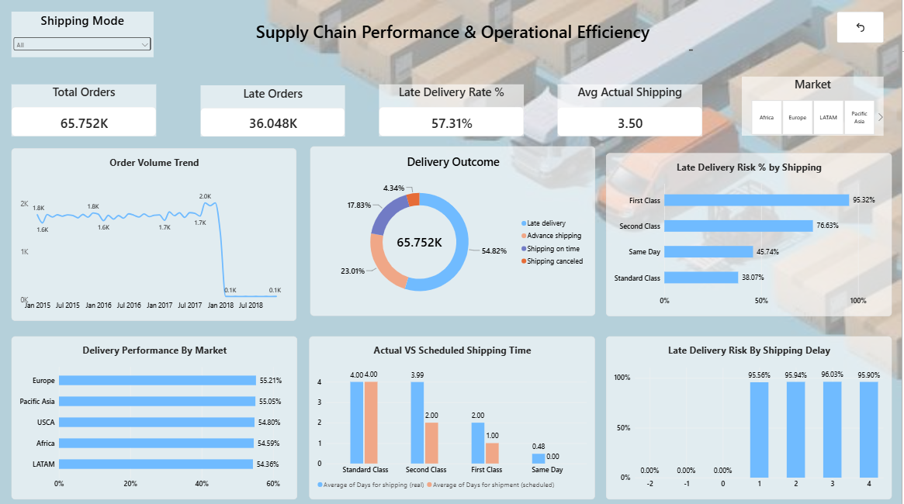

# DataCo Supply Chain Analytics
### End-to-End Supply Chain Performance & Operational Efficiency

An end-to-end supply chain analytics project identifying the key operational drivers behind late delivery — from order movement and fulfillment to delivery reliability, shipping behavior, and market-level patterns — combining **SQL, Python, and Power BI**.

---

## Overview

DataCo's operational records cover orders, products, customers, markets, shipping, and fulfillment. This project investigates where and why delivery performance breaks down, using a hypothesis-driven approach to move from broad operational context to a validated root cause, then translates the findings into an interactive Power BI dashboard.

**Flow:** Data Foundation → Data Validation → Operational Baseline → Demand → Product & Fulfillment → Delivery & Shipping → Geography & Market → Cost & Profitability → Exceptions → Digital Signals → Hypothesis Testing → Validation → Business Actions → Power BI Dashboard

---

## Dataset

| Source | Purpose |
|---|---|
| `supply_chain` | Core operational analysis (180,519 records) |
| `dataset_description` | Field reference documentation |
| `access_logs` | Supporting digital-demand signal |

**Scale:** 65,752 distinct orders · 20,652 customers · 118 products · ~2.75 records/order

Source: [DataCo Smart Supply Chain Dataset](https://www.kaggle.com/datasets/shashwatwork/dataco-smart-supply-chain-for-big-data-analysis) (Kaggle)

---

## Tools & Approach

| Tool | Used for |
|---|---|
| **SQL (SQLite)** | Structured extraction, aggregation, CTEs, window functions, cross-source validation |
| **Python (pandas)** | Flexible transformation, reshaping, hypothesis testing, cross-domain comparison |
| **Power BI** | Interactive dashboard built on validated findings |

SQL and pandas are used deliberately for different purposes — not interchangeably.

---

## Key Findings

- **57.31%** of orders (among completed delivery outcomes) are delivered late — 36,048 orders / 210,569 units
- **Fulfillment delay is the strongest driver:** orders exceeding scheduled shipping time carry a **~96% late-delivery risk**, vs. 0% when on schedule
- **Shipping mode is the second strongest driver:** First Class carries the highest risk at **95.32%**, consistently across every market — vs. 38.07% for Standard Class
- **Order quantity and geography show weak association** with delivery risk — ruled out as primary drivers
- **Faster shipping ≠ higher profitability** (First Class: 2.00 days, 0.13 profit ratio vs. Same Day: 0.48 days, 0.12 ratio) — delivery improvements must be balanced against cost discipline

### Hypothesis Testing

| Hypothesis | Finding | Result |
|---|---|---|
| H1 – Shipping Mode → Late Delivery | Strong association | Supported |
| H2 – Shipping Mode + Market | Consistent across markets | Supported |
| H3 – Order Quantity → Late Delivery | Weak association | Not Supported |
| H4 – Fulfillment Delay → Late Delivery | ~96% risk beyond schedule | Strongly Supported |

### Fulfillment Delay → Risk

| Shipping Delay | Late Delivery Risk |
|---:|---:|
| ≤ 0 days | 0.00% |
| +1 day | 95.56% |
| +2 days | 95.94% |
| +3 days | 96.03% |
| +4 days | 95.90% |

### Shipping Mode → Risk

| Shipping Mode | Late Delivery Risk |
|---|---:|
| First Class | 95.32% |
| Second Class | 76.63% |
| Same Day | 45.74% |
| Standard Class | 38.07% |

---

## Metric Note: 57.31% vs. 54.82%

The dashboard KPI (57.31%) and the delivery-outcome donut (54.82%) use different denominators — both are correct:
- **57.31%** = late orders ÷ completed outcomes (36,048 / 62,897, excluding canceled)
- **54.82%** = late orders ÷ all orders (36,048 / 65,752, including canceled)

---

## Business Recommendations

1. **Improve schedule adherence** — fulfillment delay has the strongest link to late delivery; monitor the scheduled-vs-actual gap
2. **Review First Class execution** across markets given its consistently high risk
3. **Prioritize higher-volume shipping modes** to impact more orders per improvement
4. **Balance delivery speed with cost discipline** — faster shipping doesn't guarantee higher profit
5. Use demand and digital-access patterns as supporting signals for ongoing monitoring

---

## Power BI Dashboard

Single-page interactive dashboard built on the validated SQL/Python findings.



**KPIs:** Total Orders (65.752K) · Late Orders (36.048K) · Late Delivery Rate (57.31%) · Avg Actual Shipping (3.50 days)

**Visuals:** Order Volume Trend · Delivery Outcome Breakdown · Late Delivery Risk % by Shipping Mode · Delivery Performance by Market · Actual vs. Scheduled Shipping Time · Late Delivery Risk by Shipping Delay

**Interactivity:** Shipping Mode slicer · Market selector (Africa, Europe, LATAM, Pacific Asia, USCA)


---

## Repository Structure

```text
Dataco-Supply-Chain-Analytics/
│
├── data/
│   ├── DescriptionDataCoSupplyChain.csv
│   └── tokenized_access_logs.csv
│
├── sql/
│   ├── create_database.py
│   ├── import_data.py
│   └── run_query.py
│
├── .gitignore
├── 01_supply_chain_analysis.ipynb
├── README.md
└── supply_chain_dashboard.png


---

## Author

**Saran T**  
MBA

🔗 [LinkedIn](https://www.linkedin.com/in/saran-t-297b25290)
